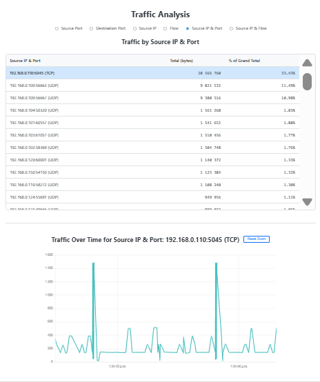

# **Pcapng Traffic Analyzer**

This is a .NET console application for analyzing network traffic from .pcapng files. It processes large capture files to generate histograms of TCP and UDP traffic, providing both a summary in the console and a rich, interactive HTML report with filterable views and time-series charts.



## **What It Does**

The tool reads a .pcapng file and aggregates packet data to help you understand traffic patterns. You can analyze the data based on the total volume of bytes or the total number of packets. The primary output is a detailed HTML report that allows you to visualize and explore the data dynamically.

### **Key Features**

* **Interactive HTML Reports**: Generates a self-contained HTML file with interactive charts and tables.  
* **Multiple Analysis Views**: Group and analyze traffic by:  
  * Source Port  
  * Destination Port  
  * Source IP Address  
  * Flow (Source Port → Destination Port)  
  * Source IP & Port  
  * Source IP & Flow  
* **Interactive Time-Series Charts**: Click on any item to view a detailed time-series chart of traffic volume. The charts support intuitive panning and zooming along the time axis, allowing you to inspect specific periods in detail.  
* **Flexible Measurement**: Analyze traffic by total bytes (transport-layer payload + header) or by the number of packets.  
* **Advanced Filtering**: Exclude specific traffic from the analysis by blacklisting TCP ports, UDP ports, or source IP addresses.  
* **Console Output**: Provides a quick summary of the analysis directly in your terminal.  
* **IPv4 & IPv6 Support**: Parses and analyzes both IPv4 and IPv6 traffic.

## **How to Use**

### **Prerequisites**

* [.NET SDK](https://dotnet.microsoft.com/download) (Version 6.0 or later recommended).

### **Building and Running**

1. **Restore Dependencies**: Open a terminal in the project directory and restore the required Haukcode.PcapngUtils package:

`dotnet restore`

2.   **Run the Application**: Use dotnet run to execute the application, passing the path to your .pcapng file and any desired options.

`dotnet run -- <path-to-your-capture.pcapng> [optionsoptions]`


### **Command-Line Options**

| Option | Description | Example |
| :---- | :---- | :---- |
| --html=<file> | **(Required for report)** Specifies the path to generate the interactive HTML report. | --html=report.html |
| --mode=<mode> | Sets the analysis mode. <mode> can be bytes (default) or packets. | --mode=packets |
| --blacklist-tcp-ports=<list> | A comma-separated list of TCP ports to exclude from the analysis. | --blacklist-tcp-ports=443,8080 |
| --blacklist-udp-ports=<list> | A comma-separated list of UDP ports to exclude from the analysis. | --blacklist-udp-ports=53,123 |
| --blacklist-ips=<list> | A comma-separated list of source IP addresses to exclude from the analysis. | --blacklist-ips=8.8.8.8,1.1.1.1 |

### **Examples**

**Basic analysis with an HTML report:**

```
dotnet run -- my_capture.pcapng --html=analysis.html
```

**Analyze by packet count instead of bytes:**

```
dotnet run -- my_capture.pcapng --html=analysis_packets.html --mode=packets`
```

**Exclude common web (HTTP/S) and DNS traffic:**

```
dotnet run -- my_capture.pcapng --html=filtered_report.html --blacklist-tcp-ports=80,443 --blacklist-udp-ports=53`
```

**Ignore traffic from a specific backup server:**

```
dotnet run -- my_capture.pcapng --html=report.html --blacklist-ips=192.168.1.100`
```

